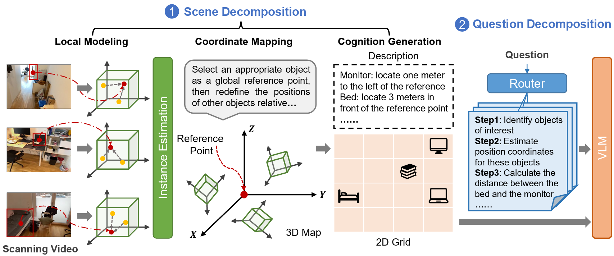
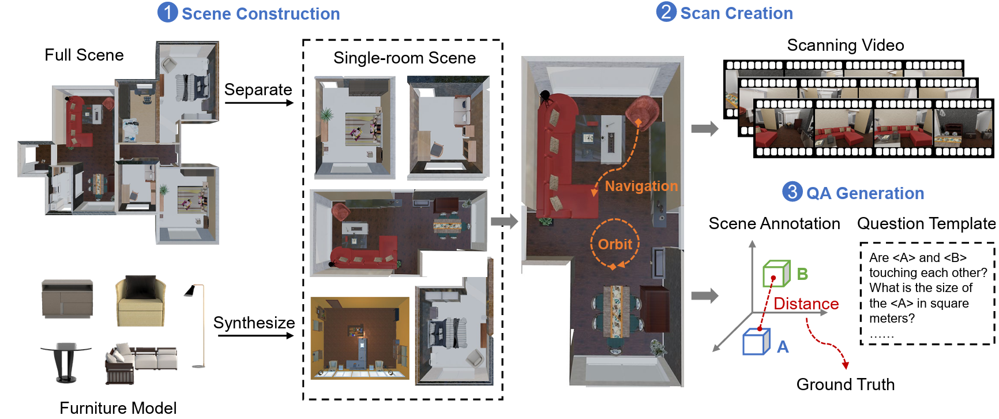
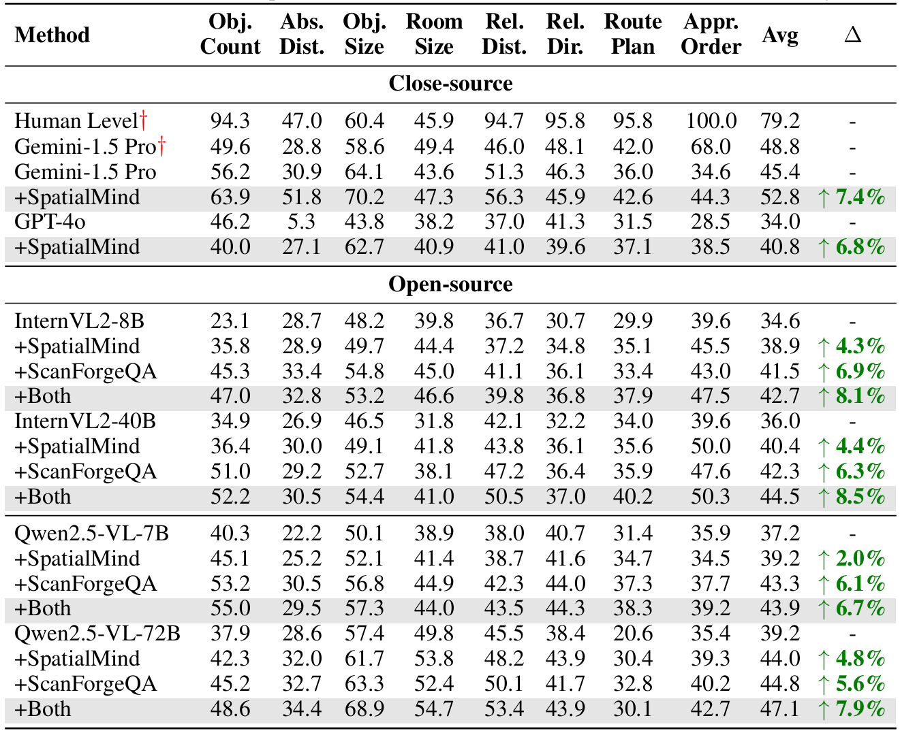

# Spatial Understanding from Videos: Structured Prompts Meet Simulation Data

## Authors

Haoyu Zhang<sup>1,2</sup>, Meng Liu<sup>3,4*</sup>, Zaijing Li<sup>1,2</sup>, Haokun Wen<sup>1</sup>, Weili Guan<sup>1</sup>, Yaowei Wang<sup>1,2</sup>, Liqiang Nie<sup>1*</sup>

<sup>1</sup> Harbin Institute of Technology (Shenzhen)  
<sup>2</sup> Pengcheng Laboratory  
<sup>3</sup> Shandong Jianzhu University  
<sup>4</sup> Zhongguancun Academy  

\* Corresponding authors

## Overview

The paper presents a two-part framework for improving 3D spatial understanding from scanning videos:

1. `SpatialMind Prompting Strategy`
   - `Scene Decomposition`
     - `Local Modeling`: infer object-centric local relations from partial observations.
     - `Coordinate Mapping`: align local observations into a global 3D map and a 2D grid.
     - `Cognition Generation`: convert the aligned geometry into textual scene descriptions.
   - `Question Decomposition`
     - route an input question to a known spatial reasoning template or build generic reasoning steps.

2. `ScanForgeQA Dataset Construction`
   - `Scene Construction`: assemble room-level layouts with object metadata.
   - `Scan Creation`: generate orbit and navigation trajectories that mimic scanning videos.
   - `QA Generation`: synthesize question-answer pairs from the scene graph and spatial ground truth.

## Repository Layout

```text
.
├── asset/
├── examples/
│   └── scene_spec.json
├── src/
│   └── spaceera/
│       ├── cli.py
│       ├── schemas.py
│       ├── spatialmind/
│       └── scanforgeqa/
├── tests/
├── gen_scene_exp.py
├── nav_script.py
├── reason_steps.py
└── pyproject.toml
```

## SpatialMind Prompting Strategy

`SpatialMind` is implemented in [`src/spaceera/spatialmind`](./src/spaceera/spatialmind).



### Scene Decomposition

The module [`src/spaceera/spatialmind/scene_decomposition.py`](./src/spaceera/spatialmind/scene_decomposition.py) generates three complementary views from a structured scene graph:

- `local_modeling`
  - chooses a room-level anchor object
  - measures every object relative to that anchor
- `coordinate_mapping`
  - selects a global reference object
  - produces a relative 3D map
  - projects the scene onto a normalized 2D grid
- `cognition_generation`
  - converts coordinates into textual spatial descriptions

### Question Decomposition

The module [`src/spaceera/spatialmind/question_decomposition.py`](./src/spaceera/spatialmind/question_decomposition.py) classifies a question against the reasoning templates defined in [`src/spaceera/spatialmind/question_bank.py`](./src/spaceera/spatialmind/question_bank.py).

Supported question families include:

- `relative_distance`
- `object_count`
- `appearance_order`
- `relative_direction`
- `object_size`
- `absolute_distance`
- `room_size`
- `route_plan`

### Prompt Package Output

The module [`src/spaceera/spatialmind/pipeline.py`](./src/spaceera/spatialmind/pipeline.py) assembles:

- a system prompt
- the full scene decomposition payload
- the question decomposition payload

This output is meant to be passed to a downstream VLM or multimodal reasoning model.

## ScanForgeQA Dataset Construction

`ScanForgeQA` is implemented in [`src/spaceera/scanforgeqa`](./src/spaceera/scanforgeqa). The code mirrors the three-stage construction process shown below.



### 1. Scene Construction

The module [`src/spaceera/scanforgeqa/scene_construction.py`](./src/spaceera/scanforgeqa/scene_construction.py) converts a compact scene specification into a normalized scene structure with:

- room geometry
- object categories
- object centers and box sizes
- optional metadata for later control or filtering

The example file [`examples/scene_spec.json`](./examples/scene_spec.json) shows the expected input schema.

### 2. Scan Creation

The module [`src/spaceera/scanforgeqa/scan_creation.py`](./src/spaceera/scanforgeqa/scan_creation.py) creates a synthetic scan sequence with two motion primitives:

- `orbit`: rotate around a reference object to maximize local coverage
- `move_forward`: sweep through each room to simulate egocentric scanning

The same module can also export a Blender camera script so the trajectory can be replayed in a renderer.

### 3. QA Generation

The module [`src/spaceera/scanforgeqa/qa_generation.py`](./src/spaceera/scanforgeqa/qa_generation.py) generates QA pairs from scene annotations and ground-truth geometry. The current pipeline includes:

- distance questions
- object count questions
- room area questions

## Installation

```bash
python3 -m pip install -e .
```

## Quick Start

### 1. Build a Scene Graph

```bash
spaceera build-scene \
  --scene-spec examples/scene_spec.json \
  --output outputs/scene_graph.json
```

### 2. Build a Synthetic Scan

```bash
spaceera build-scan \
  --scene-graph outputs/scene_graph.json \
  --output outputs/scan_sequence.json \
  --blender-script outputs/scan_camera.py
```

### 3. Generate ScanForgeQA Pairs

```bash
spaceera generate-qa \
  --scene-graph outputs/scene_graph.json \
  --output outputs/qa_pairs.json
```

### 4. Build a SpatialMind Prompt Package

```bash
spaceera spatialmind \
  --scene-graph outputs/scene_graph.json \
  --question "What is the distance between the sofa and the coffee table?" \
  --output outputs/spatialmind_prompt.json
```

## Utility Scripts

The scripts are preserved as utility entry points:

- [`reason_steps.py`](./reason_steps.py): prints decomposed reasoning steps for one question.
- [`gen_scene_exp.py`](./gen_scene_exp.py): prints the scene decomposition payload.
- [`nav_script.py`](./nav_script.py): generates a Blender camera script from the example scene.

## Data Schemas

The shared dataclasses live in [`src/spaceera/schemas.py`](./src/spaceera/schemas.py). They define:

- `SceneGraph`
- `Room`
- `ObjectInstance`
- `ScanSequence`
- `ScanTrajectoryStep`
- `VideoFrame`
- `QuestionAnswer`

This keeps `SpatialMind` and `ScanForgeQA` aligned around the same structured representation.

## Testing

Run the lightweight end-to-end test with:

```bash
PYTHONPATH=src python3 -m unittest discover -s tests -p 'test_*.py'
```


## Evaluation



## Citation

```bibtex
@article{zhang2025spatial,
  title={Spatial Understanding from Videos: Structured Prompts Meet Simulation Data},
  author={Zhang, Haoyu and Liu, Meng and Li, Zaijing and Wen, Haokun and Guan, Weili and Wang, Yaowei and Nie, Liqiang},
  journal={arXiv preprint arXiv:2506.03642},
  year={2025}
}
```

## Acknowledgements

We thank the authors of [VSI-Bench](https://github.com/vision-x-nyu/thinking-in-space) for releasing their benchmark, and the authors of [LLaMA-Factory](https://github.com/hiyouga/LLaMA-Factory) for their training framework.

## License

MIT
